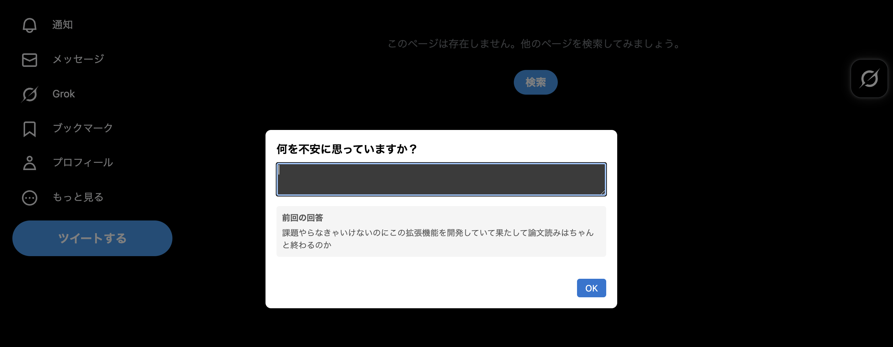

# Distract-Aware
Twitter / YouTube を開いたときに自分の行動の目的を再考させるきっかけを与えるChrome拡張機能です。開発者本人がとりあえず実験的に使ってみています。

- このプロジェクトのコードの多くはOpenAI社の大規模言語モデルGPT-5.1を使って生成されていますが、コードの整理は開発者本人が行っています。

### 動機
作業中に漠然とした不安を感じると、その不安を打ち消すために Twitter や YouTube で新しい情報を浴びる人もいると思います。しかし実際には、すぐに元の作業に戻れず、気づいたら長時間 SNS を閲覧していた...という経験があります。

この拡張機能は、その瞬間に一呼吸置く時間を作る（はずです）。「何を求めて今これを見ようとしているのか」を言語化することで：
- 本当に今その不安を解消する必要があるのか、判断がつきやすくなる
- 不要な情報収集から自分を守ることができる
- 必要な場合でも、目的を明確にしたうえで SNS を使える

あたりを狙っています。

### インストール
- ビルド：`vite`などのバンドラーを用いて、TypeScriptコードを`dist/content.js`に全てまとめてコンパイルします。
- ブラウザへの適用：Chromeに拡張機能を読ませます。
  - Chrome で`chrome://extensions/` を開きます。
  - 「デベロッパー モード」をオン
  - 「パッケージ化されていない拡張機能を読み込む」をクリック
  - このプロジェクトのルートディレクトリを選択

### ファイル構成
主要ファイルの役割
- `main.ts`: 拡張機能の初期化。前回の入力をストレージから取得し、プロンプトを表示。入力後、新しい回答を保存します
- `ui.ts`: ダイアログの UI 構築と IME 対応の Enter キーリスナー実装
- `ui_css.ts`: ダイアログのスタイル定義（オーバーレイ、ボタン、エラー表示など）

### 対象サイト
- `https://twitter.com/*`
- `https://x.com/*`
- `https://www.youtube.com/*`
manifest.json で対象サイトを指定しています。
